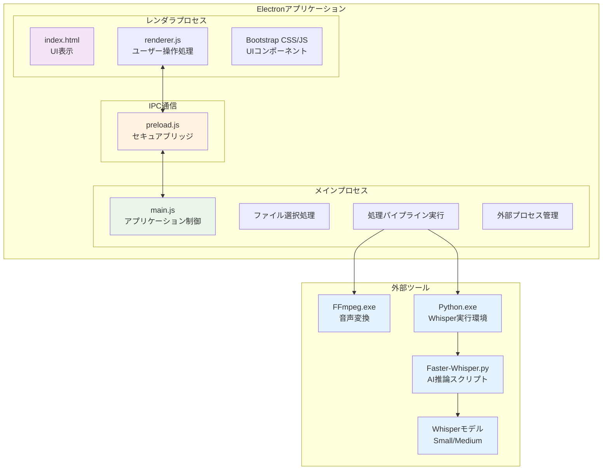
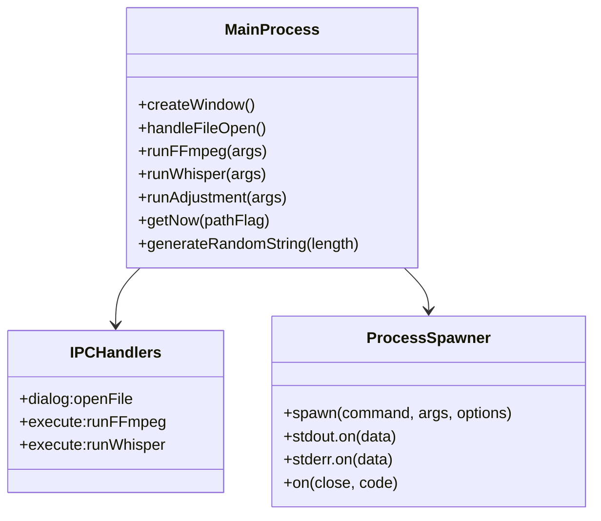
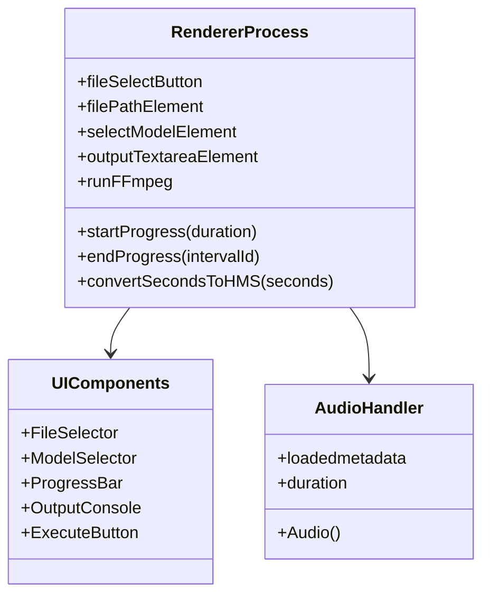
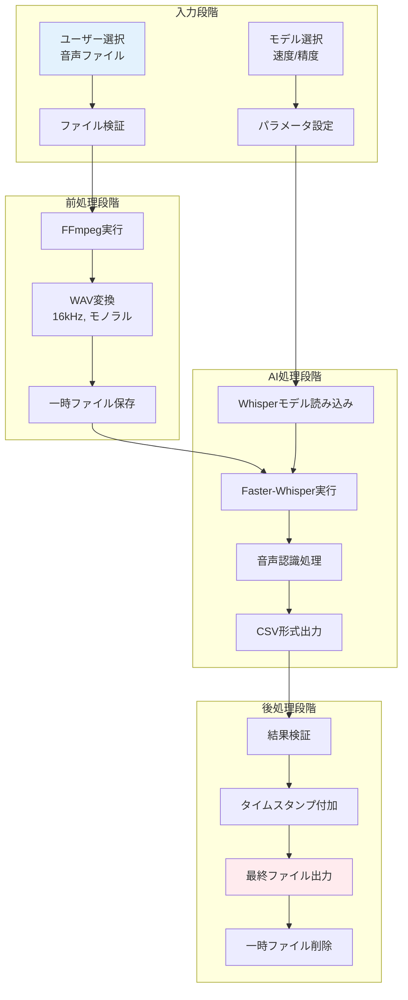
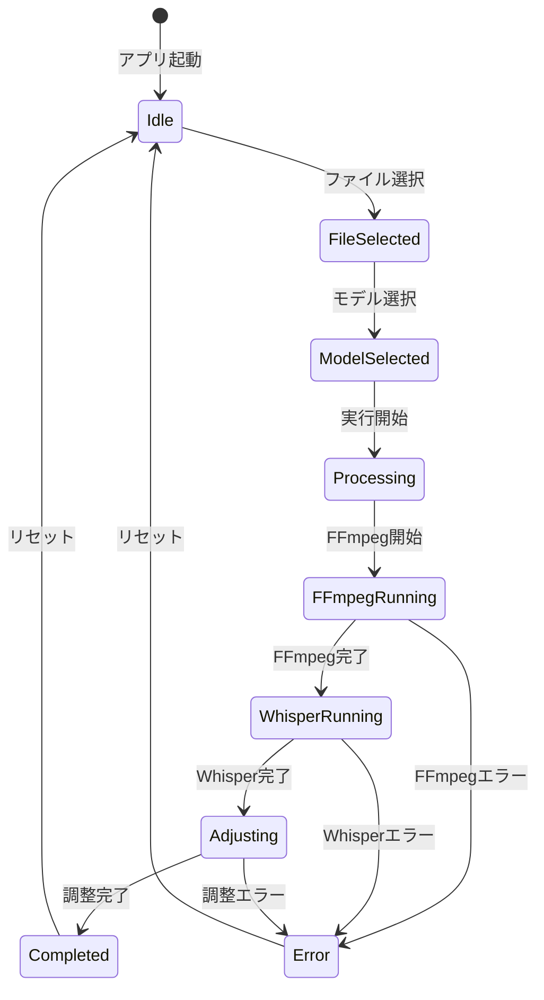
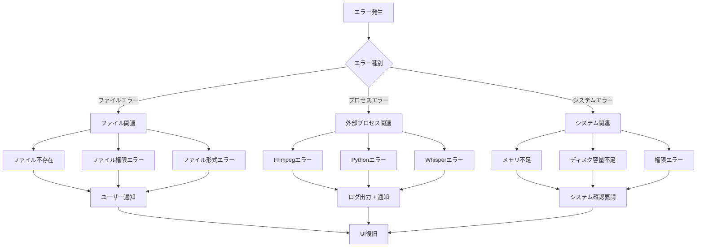
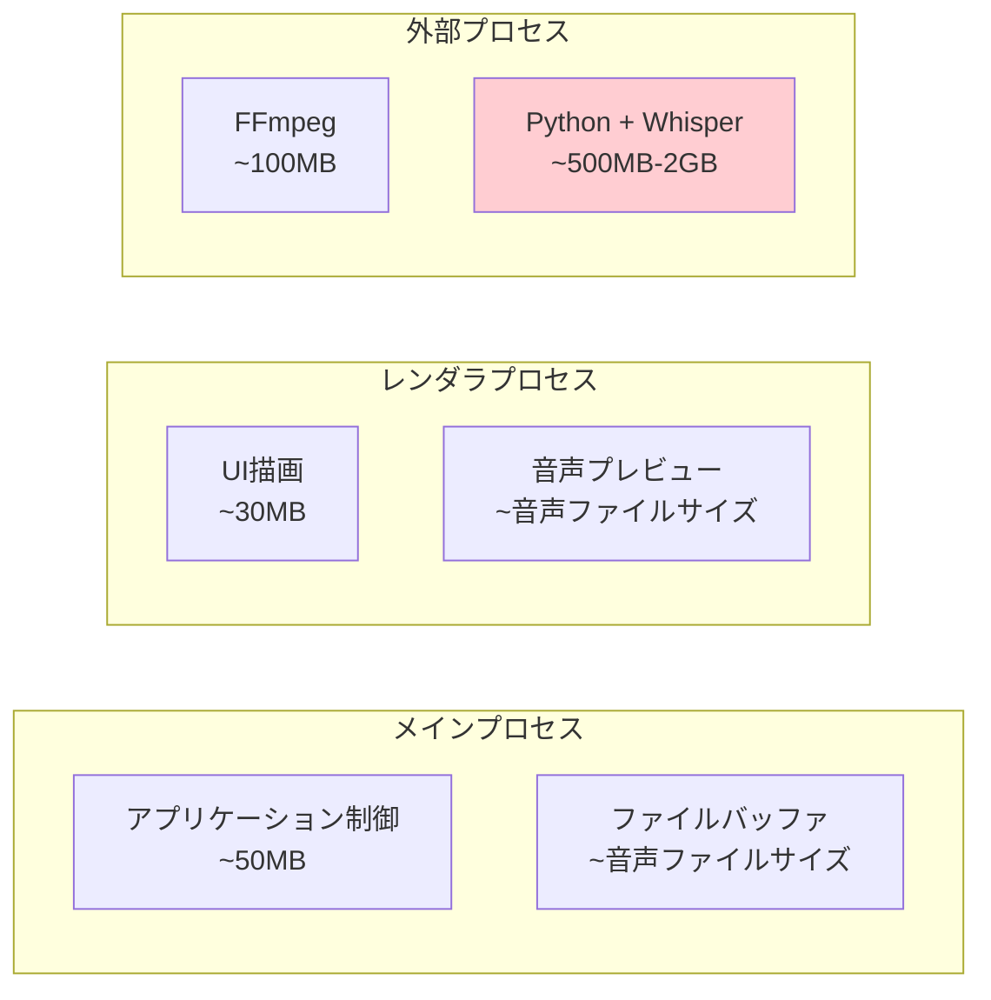
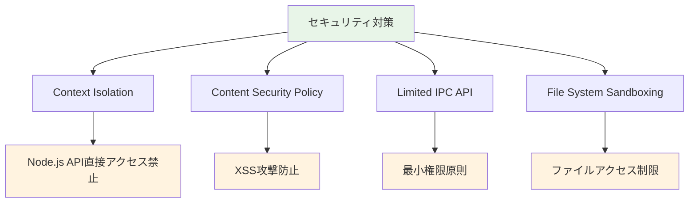
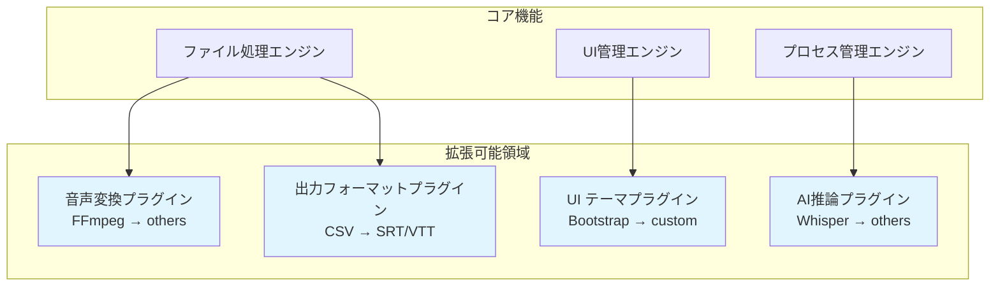
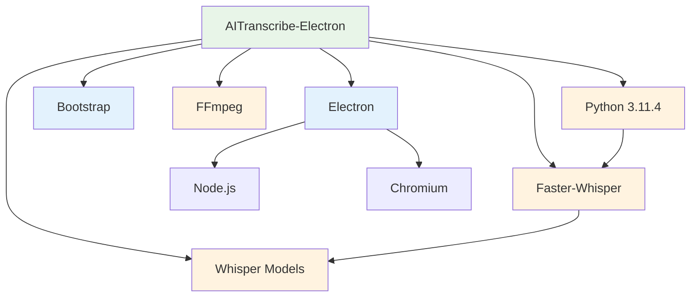

# AITranscribe-Electron アーキテクチャ概要

このドキュメントでは、AITranscribe-Electronのアーキテクチャの設計思想と技術的な詳細を説明します。

## アーキテクチャ概要

AITranscribe-Electronは、Electronフレームワークを基盤とした音声文字起こしアプリケーションです。マルチプロセスアーキテクチャを採用し、セキュリティと安定性を重視した設計となっています。



## 技術スタック

### フロントエンド技術
- **Electron**: デスクトップアプリケーションフレームワーク
- **HTML5**: マークアップ
- **JavaScript (ES6+)**: フロントエンド動的処理
- **Bootstrap 5.3.0**: UIコンポーネントライブラリ
- **CSS3**: スタイリング

### バックエンド技術
- **Node.js**: JavaScript実行環境
- **Electron Main Process**: アプリケーション制御
- **Child Process**: 外部プロセス実行
- **File System**: ファイル操作

### 外部ツール・AI技術
- **FFmpeg**: 音声フォーマット変換
- **Python 3.11.4**: AI推論実行環境
- **Faster-Whisper**: OpenAI Whisper最適化版
- **Whisper Models**: Small/Mediumモデル

## プロセス設計

### メインプロセス (main.js)



#### 主要責務
1. **アプリケーションライフサイクル管理**
2. **ウィンドウ作成・管理**
3. **IPC通信ハンドリング**
4. **外部プロセス実行・監視**
5. **ファイルシステム操作**
6. **エラーハンドリング**

### レンダラプロセス (renderer.js)



#### 主要責務
1. **ユーザーインターフェース管理**
2. **ユーザー操作ハンドリング**
3. **進捗表示・更新**
4. **結果表示**
5. **エラー表示**

### IPC通信設計 (preload.js)

```mermaid
graph LR
    subgraph "Renderer Context"
        R[renderer.js]
    end
    
    subgraph "Preload Script"
        P[preload.js<br/>contextBridge]
    end
    
    subgraph "Main Context"
        M[main.js]
    end
    
    R -->|electronAPI.openFile()| P
    R -->|electronAPI.runFFmpeg()| P
    R -->|electronAPI.returnCommand()| P
    R -->|electronAPI.processMassage()| P
    
    P -->|ipcRenderer.invoke()| M
    P -->|ipcRenderer.send()| M
    P <-->|ipcRenderer.on()| M
    
    style P fill:#fff3e0
```

#### セキュリティ設計
- **Context Isolation**: レンダラプロセスからの直接Node.js APIアクセス禁止
- **Limited API Surface**: 必要最小限のAPIのみ公開
- **Type Safety**: 明確なインターフェース定義

## データフロー設計

### ファイル処理パイプライン



### 状態管理



## エラーハンドリング設計

### エラー分類と対応



## パフォーマンス最適化

### メモリ管理



### 処理時間最適化

1. **非同期処理**: メインスレッドブロッキング回避
2. **プログレス表示**: ユーザー体験向上
3. **一時ファイル管理**: ディスク使用量最小化
4. **モデル選択**: 速度/精度トレードオフ

## セキュリティ設計

### 実装済みセキュリティ機能



### CSPポリシー
```html
<meta http-equiv="Content-Security-Policy" content="default-src 'self'; script-src 'self'">
```

## 拡張性設計

### プラグインアーキテクチャ候補



## 依存関係管理

### 外部依存関係



### バージョン管理戦略

| コンポーネント | 現在版 | 更新戦略 |
|---------------|--------|----------|
| Electron | Latest | 定期更新（セキュリティ重視） |
| Bootstrap | 5.3.0 | 安定版追従 |
| FFmpeg | Bundled | 機能要求時更新 |
| Python | 3.11.4 | LTS版使用 |
| Faster-Whisper | Latest | 性能改善時更新 |

---

*このドキュメントは、AITranscribe-Electronの技術的詳細とアーキテクチャ設計を包括的に説明しています。開発・保守・拡張の際の参考資料としてご活用ください。*