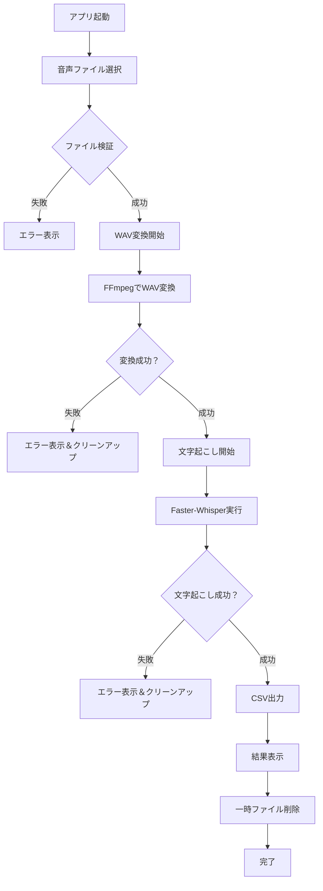
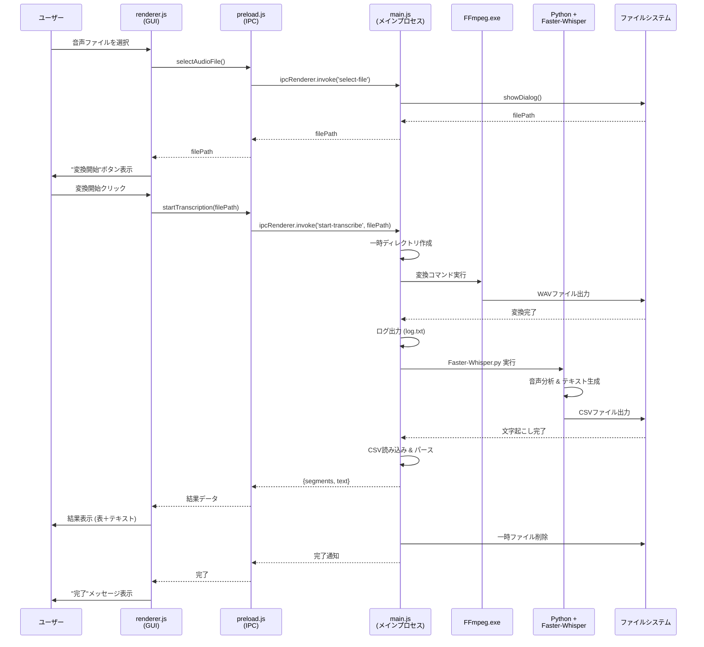
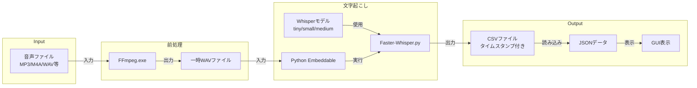
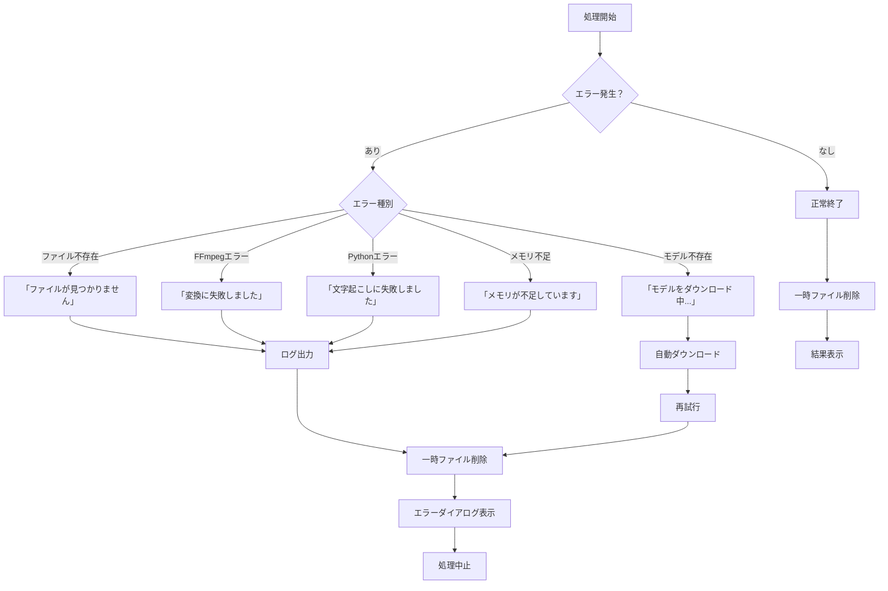
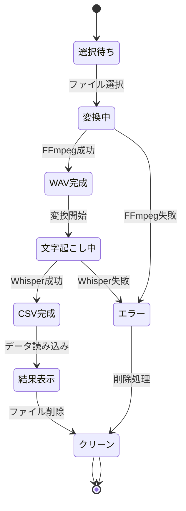

# AITranscribe-Electron 処理フロー図

このドキュメントは、AITranscribe-Electron アプリケーションの実際の処理フローを可視化したものです。

## 1. ユーザー操作フロー（全体像）

## 2. システム内部処理フロー（詳細）

## 3. データフロー図

## 4. エラーハンドリングフロー

## 5. ファイル状態遷移図

## フローの主要ポイント

### ✅ 正常系
1. **ファイル選択** → ダイアログ表示 → パス取得
2. **WAV変換** → FFmpeg実行 → 16kHz/monoに変換
3. **文字起こし** → Pythonスクリプト実行 → CSV生成
4. **結果表示** → CSVパース → GUI表示
5. **クリーンアップ** → 一時ファイル削除

### ⚠️ 異常系
- **ファイル不存在**: エラーダイアログ表示
- **FFmpeg失敗**: ログ出力後、エラー表示
- **モデル不存在**: 自動ダウンロード→再試行
- **メモリ不足**: エラー表示後、クリーンアップ

### 🔧 補足
- 全ての一時ファイルは `os.tmpdir()` 配下に作成
- ログファイル `log.txt` は常に最新の状態に更新
- CSV出力後は即座に削除され、ユーザーには見えない

---

*このフロー図は v2.1.0 のコードベースに基づいています。*
