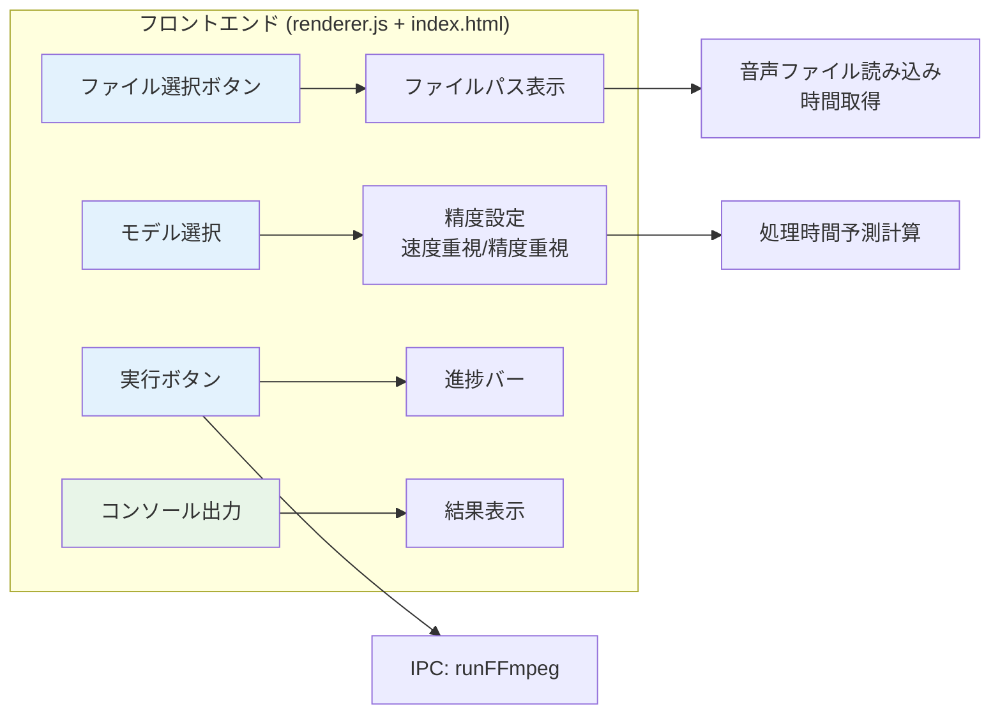
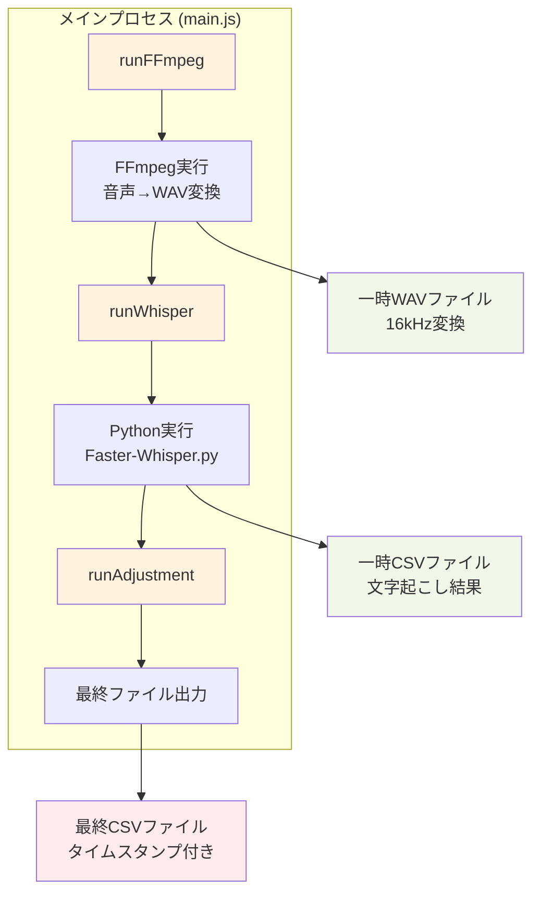
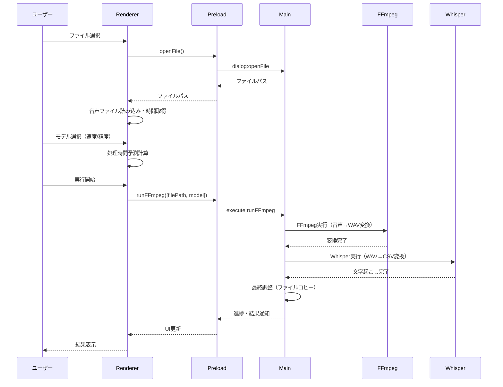
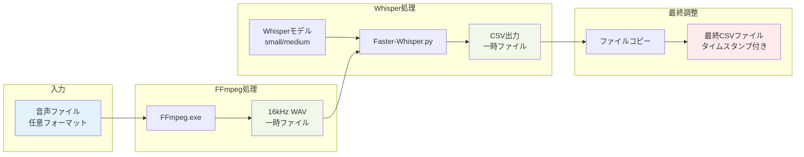
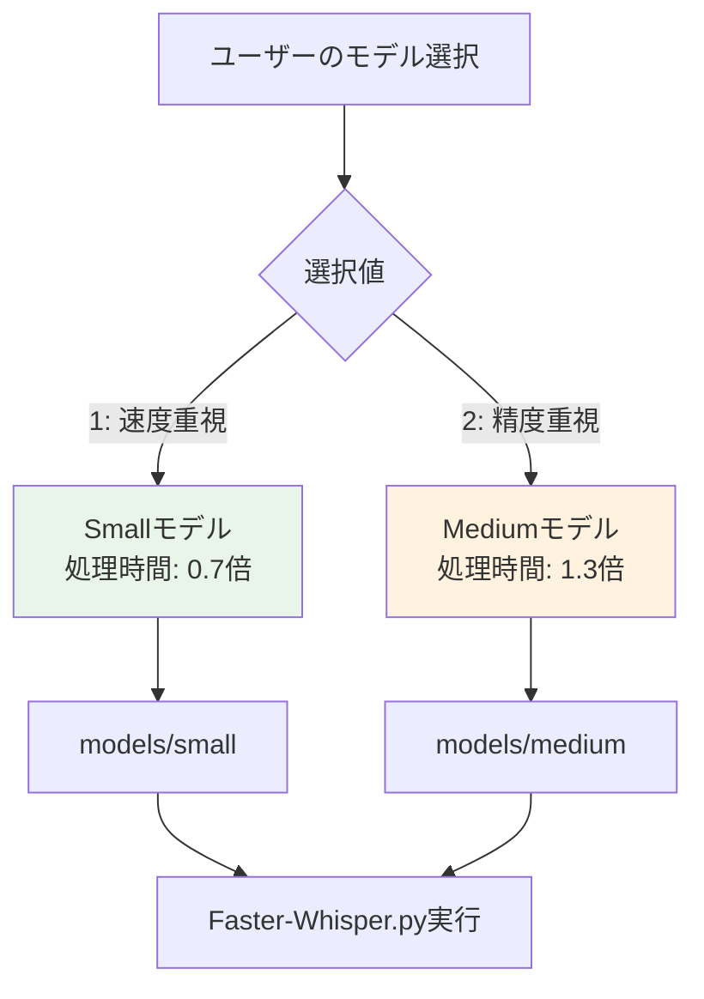
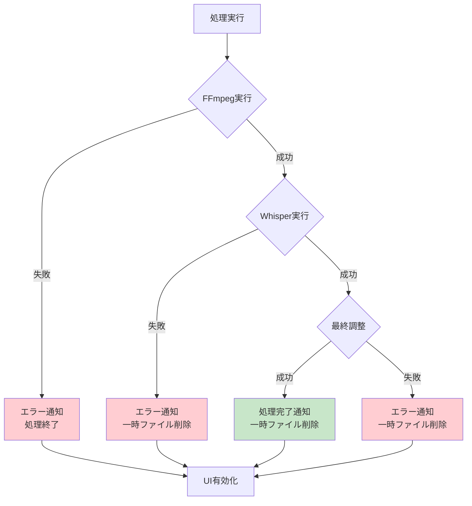
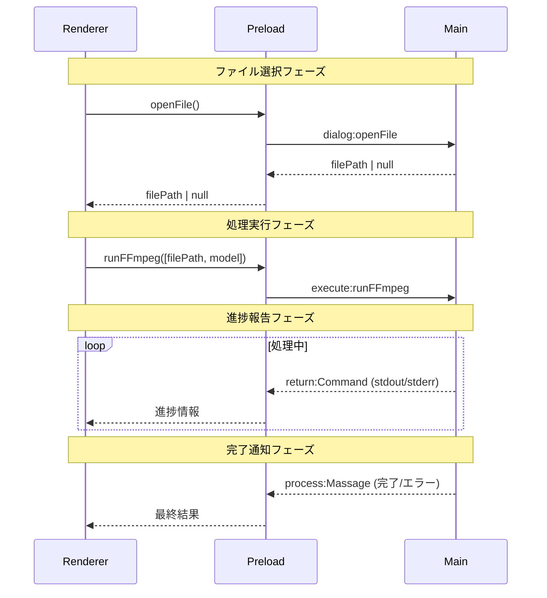

# AITranscribe-Electron 処理フロー図

このドキュメントでは、AITranscribe-Electronアプリケーションの現在の処理フローを視覚化し、詳細に説明します。

## 概要

AITranscribe-Electronは、OpenAIのWhisperを活用した音声文字起こしアプリケーションです。Electronベースのデスクトップアプリケーションとして実装されており、以下の主要コンポーネントで構成されています：

- **フロントエンド（レンダラプロセス）**: ユーザーインターフェース
- **バックエンド（メインプロセス）**: 処理パイプライン実行
- **IPCコミュニケーション**: プロセス間通信
- **外部ツール**: FFmpeg、Faster-Whisper

## 全体処理フロー

```mermaid
graph TD
    A[ユーザー] -->|ファイル選択| B[フロントエンド<br/>renderer.js + index.html]
    A -->|モデル選択| B
    A -->|実行開始| B
    
    B -->|IPC通信| C[プリロード<br/>preload.js]
    C -->|IPC通信| D[メインプロセス<br/>main.js]
    
    D -->|1. 音声変換| E[FFmpeg実行<br/>runFFmpeg()]
    E -->|WAVファイル生成| F[一時WAVファイル<br/>temp.wav]
    
    F -->|2. 文字起こし| G[Whisper実行<br/>runWhisper()]
    G -->|Python実行| H[Faster-Whisper.py]
    H -->|CSVファイル生成| I[一時CSVファイル<br/>temp.wav.csv]
    
    I -->|3. 最終調整| J[最終調整<br/>runAdjustment()]
    J -->|ファイルコピー| K[最終出力ファイル<br/>filename_timestamp.csv]
    
    D -->|進捗・結果通知| C
    C -->|UI更新| B
    B -->|結果表示| A
    
    style A fill:#e1f5fe
    style B fill:#f3e5f5
    style D fill:#e8f5e8
    style E fill:#fff3e0
    style G fill:#fff3e0
    style J fill:#fff3e0
    style K fill:#ffebee
```

## 詳細コンポーネント図

### 1. フロントエンド層



### 2. メインプロセス処理パイプライン



## データフロー詳細

### 入力データの流れ



### ファイル変換プロセス



## モデル選択による処理の違い

### モデル選択分岐



## エラーハンドリングフロー



## プロセス間通信 (IPC) 詳細

### IPCチャンネル一覧

| チャンネル名 | 方向 | 用途 |
|-------------|------|------|
| `dialog:openFile` | Renderer → Main | ファイル選択ダイアログ表示 |
| `execute:runFFmpeg` | Renderer → Main | FFmpeg＆Whisper処理実行 |
| `return:Command` | Main → Renderer | 処理の標準出力・進捗情報 |
| `process:Massage` | Main → Renderer | 処理完了・エラー通知 |

### IPC通信フロー



## ファイル構成と役割

### コアファイル

```
src/
├── index.html          # メインUI画面
├── renderer.js         # フロントエンド処理
├── main.js            # メインプロセス・処理パイプライン
├── preload.js         # IPC通信ブリッジ
└── Whisper/
    ├── Faster-Whisper.py  # 文字起こしPythonスクリプト
    ├── ffmpeg.exe         # 音声変換ツール
    ├── python.exe         # Python実行環境
    └── models/            # Whisperモデル
        ├── small/         # 速度重視モデル
        └── medium/        # 精度重視モデル
```

### 一時ファイル

```
OS一時ディレクトリ/
├── {random10文字}.wav     # FFmpeg出力（16kHz WAV）
└── {random10文字}.wav.csv # Whisper出力（CSV）
```

### 出力ファイル

```
入力ファイルと同じディレクトリ/
└── {入力ファイル名}_[YYYY-MM-DD_HH-MM-SS].csv
```

## パフォーマンス特性

### 処理時間の目安

| モデル | 精度 | 処理時間係数 | 用途 |
|--------|------|-------------|------|
| Small | 標準 | 0.7倍 | 速度重視・リアルタイム処理 |
| Medium | 高精度 | 1.3倍 | 精度重視・高品質出力 |

### リソース使用量

- **CPU**: 主にWhisper処理で使用（CPU推論）
- **メモリ**: モデルサイズに依存
- **ディスク**: 一時ファイル（WAV + CSV）
- **ネットワーク**: 不要（完全オフライン処理）

## 今後の拡張ポイント

1. **並列処理**: 長時間音声の分割処理
2. **GPU対応**: CUDA/OpenCLサポート
3. **リアルタイム処理**: ストリーミング文字起こし
4. **多言語対応**: 言語選択UI追加
5. **出力形式**: SRT、VTT等の字幕ファイル対応

---

*このドキュメントは2025年6月28日時点のバージョン2.1.0に基づいて作成されています。*